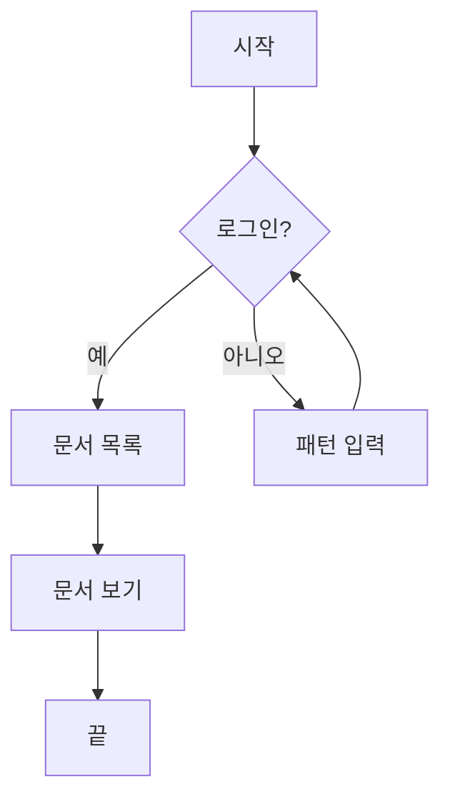
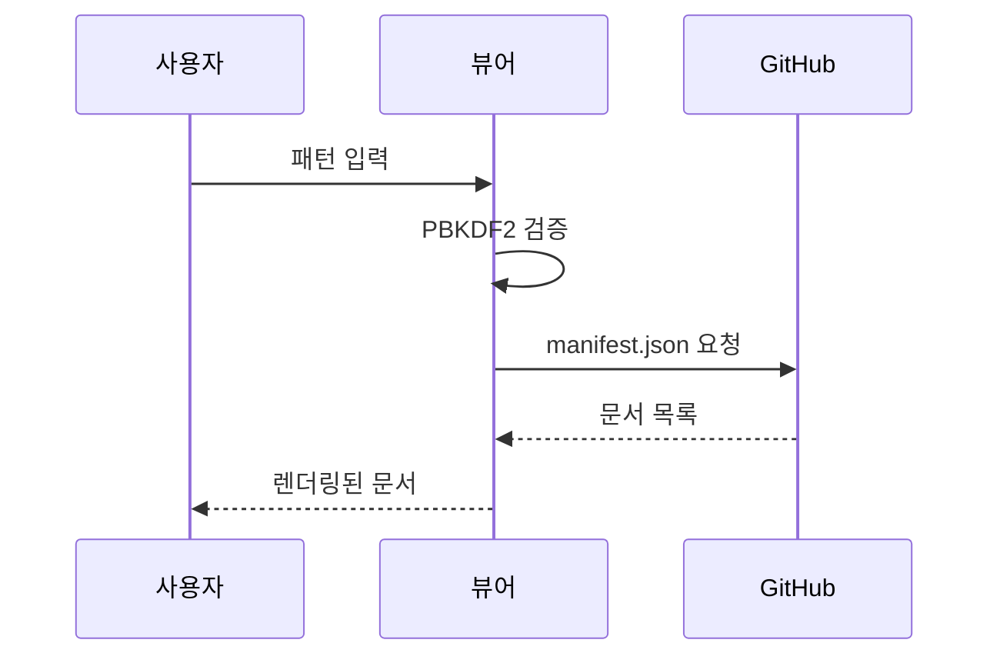
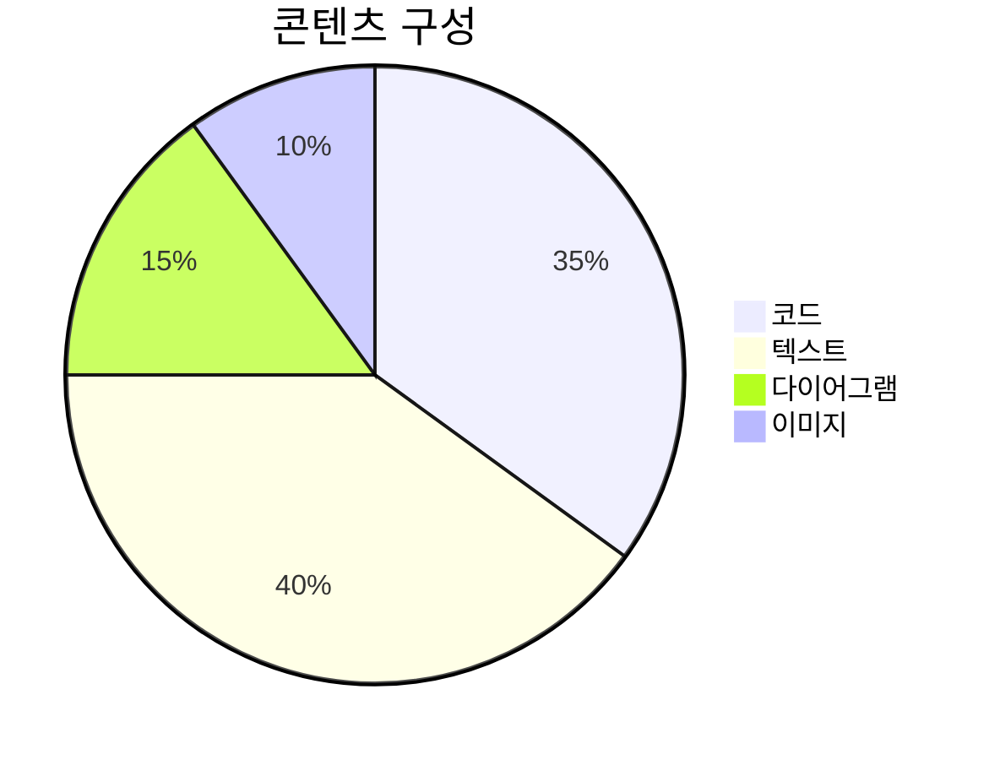
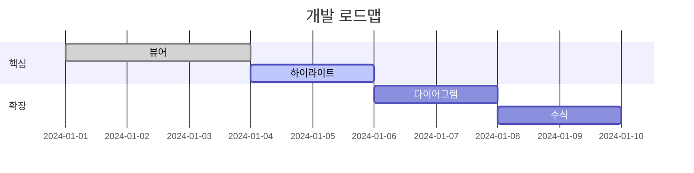
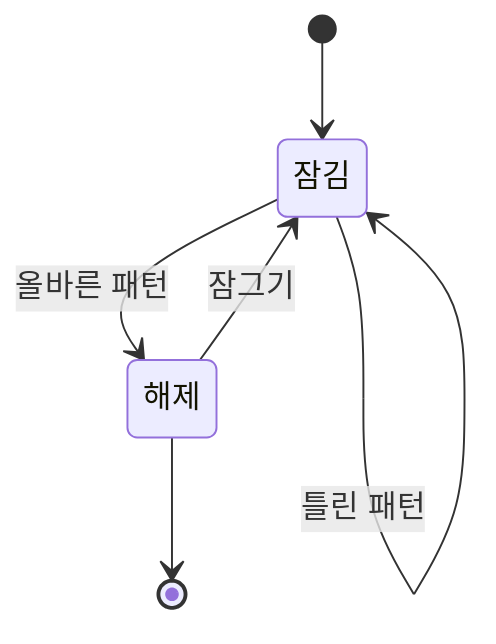

# Mermaid 다이어그램

코드 펜스에 `mermaid`를 지정하면 다이어그램으로 렌더링됩니다.

## 플로우차트



## 시퀀스 다이어그램



## 파이 차트



## 간트 차트



## 상태 다이어그램



## 잘못된 다이어그램 (오류 처리 확인)

```mermaid
this is not valid mermaid syntax @@@
```
